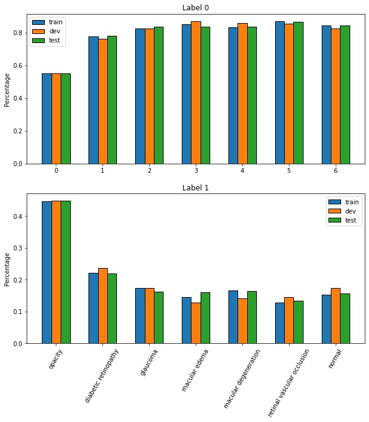
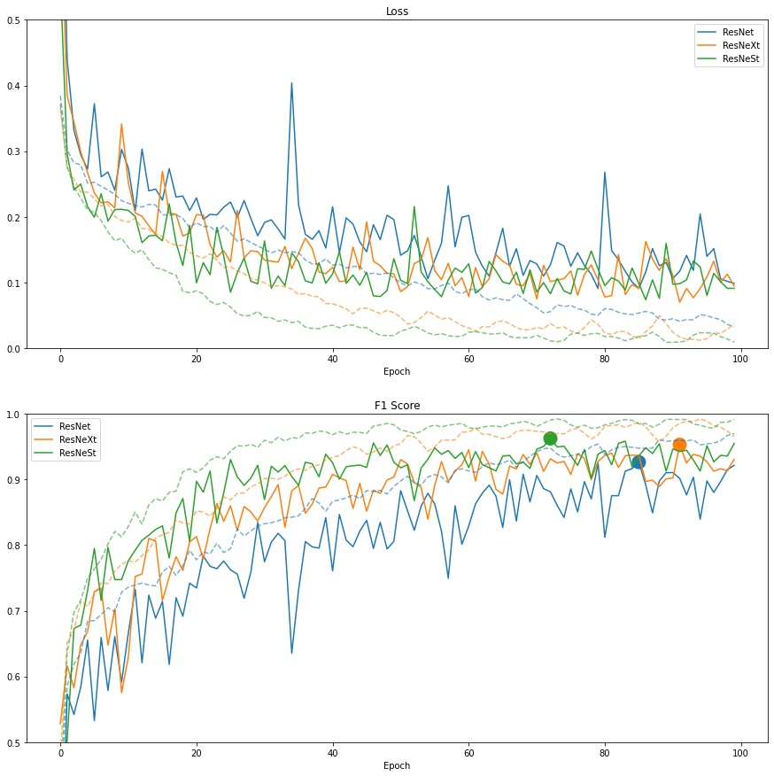
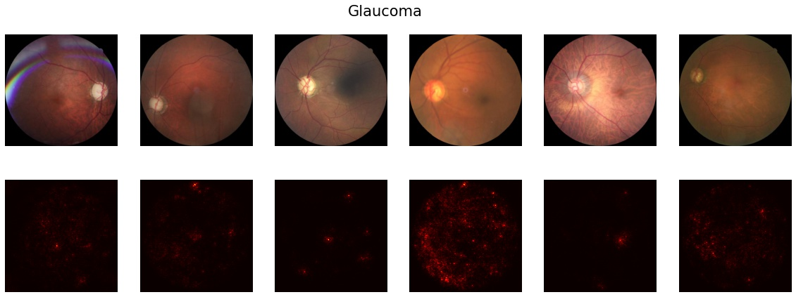
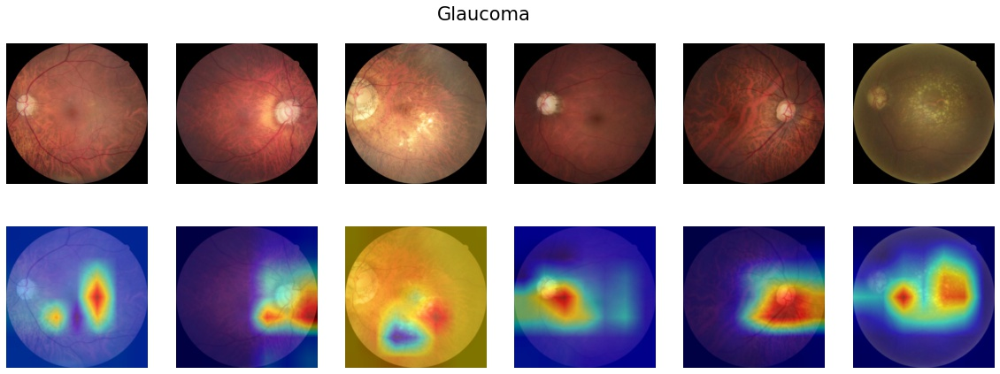
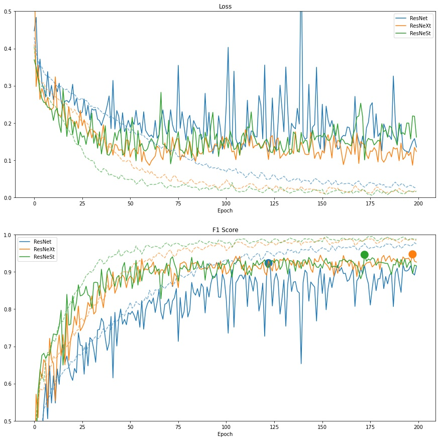

# Report
(Bruce) Wai-Ting Li

### Table of Content
1. [Classification Model](#clf-model)
1. [Network Visualization](#visualization)
1. [Semi-Supervised Learning](#semisupervised)

---
## 1: Classification Model {#clf-model}
* Approach: multi-class classification
* Model candidates
    - ResNet50
    - ResNeXt50
    - ResNeSt50
* Parameters & hyperparameters
    - optimizer: Adam
    - epochs: 100
    - learning_rate: 1e-3
    - momentum: 0.9
    - batch_size: 111
    - weight_decay: 1e-5
* Prevent overfitting: save model checkpoint only if the validation F1 score improves.

Note
* Due to computational constraint, I did not perform hyperparameter tuning. The choice of hyperparameters were adapted from the [Pytorch Baseline model on Kaggle](https://www.kaggle.com/hmchuong/pytorch-baseline-model).
* `resnest50` + `batch_size=128` will run out of cuda memory in colab, so I used `batch_size=111` for all models for fair comparison

### a: Data Splitting & Model Performance on Test Set
The original labeled training data is split into 60/10/30 train/dev/test. I randomly performed the splitting and manually assessed the distribution of each class to keep the distribution as similar as possible.

 

#### F1 Score on Test Set
| Type | ResNet50 | ResNeXt50 | ResNeSt50 |
| - | :-: | :-: | :-: | :-: |
| Opacity                    | 0.9055 | 0.9258 | 0.9544 |
| Diabetic retinopathy       | 0.9070 | 0.9310 | 0.9515 |
| Glaucoma                   | 0.8718 | 0.9030 | 0.9329 |
| Macular edema              | 0.8439 | 0.9169 | 0.9167 |
| Macular degeneration       | 0.9091 | 0.8870 | 0.9483 |
| Retinal vascular occlusion | 0.8705 | 0.8594 | 0.9446 |
| Normal                     | 0.9595 | 0.9653 | 0.9844 |
| **Average**                | **0.8953** | **0.9126** | **0.9476** |

### b: Data Augmentation
* Random horizontal flip with `p=0.5`
* Random vertical flip with `p=0.5`
* Random rotation between [-90, +90]
* Normalization using ImageNet's mean and std for each of the RGB channel
    - Mean: [0.485, 0.456, 0.406]
    - Std: [0.229, 0.224, 0.225]
* Changing brightness, contrast, saturation, hue worsened performance (It's possible that the parameters were not set properly)

I applied random flipping and rotation as the retinal images are mostly squared and it's possible for regions contributed to diseases to occur at anywhere in the image.

### c: Plot of Training-Validation Loss & F1

 The solid lines represent the validation score and the dotted line represent the training score. The markers on the plot of f1 score represent the best score achieved.

#### Best F1 Score on Dev Set
| Type | ResNet50 | ResNeXt50 | ResNeSt50 |
| - | :-: | :-: | :-: | :-: |
| **Average** | 0.9264 | 0.9531 | 0.9625 |

---
## 2: Network Visualization {#visualization}
The following images have only one class.

### Saliency Map

 

 

The saliency map tells us the degree to which each pixel in the image affects the classification score for that image.

### Grad-CAM
The target layer is the last Convolution layer of the last Bottleneck layer.

 

 

Based on the visualization of Grad-CAM, we may tell that some of the black dots may contribute to diabetic retinopathy where the visualization shows red. And we may also tell that the crack-like patterns may contribute to glaucoma.

---
## 3: Semi-Supervised Learning {#semisupervised}
* Approach: Scikit-learn Label Propagation with `rbf` kernel
* Data: the 60% labeled data (train set) + unlabeled data
* Best gamma (based on f1 score of the prediction on the labeled train set):
    - ResNet50: 0.5 (avg. f1: 0.9927)
    - ResNeXt50: 0.83 (avg. f1: 0.9795)
    - ResNeSt50: 0.07 (avg. f1: 0.9987)

Retraining Model using unlabeled data
* Since I noticed if took longer for models to converge with addition of unlabeled data, I retrained all models for 200 epochs while keeping all other hyperparameters the same.

### Model Performance on Test Set
| Type | ResNet50 | ResNeXt50 | ResNeSt50 |
| - | :-: | :-: | :-: | :-: |
| Opacity                    | 0.9266 | 0.9411 | 0.9526 |
| Diabetic retinopathy       | 0.9254 | 0.9292 | 0.9227 |
| Glaucoma                   | 0.8812 | 0.9154 | 0.9297 |
| Macular edema              | 0.8757 | 0.9097 | 0.9159 |
| Macular degeneration       | 0.9058 | 0.8903 | 0.9358 |
| Retinal vascular occlusion | 0.9058 | 0.9158 | 0.9154 |
| Normal                     | 0.9563 | 0.9718 | 0.9745 |
| **Average**                | **0.9110** | **0.9247** | **0.9352** |
| **Part 1 Average**         | **0.8953** | **0.9126** | **0.9476** |

Based on the results, the average f1 score for ResNet50 improved from 0.8953 to 0.9110 and the score for ResNeXt50 improved from 0.9126 to 0.9247, however, the score for ResNeSt50 decreased from 0.9476 to 0.9352.

### Plot of Training-Validation Loss & F1

 The solid lines represent the validation score and the dotted line represent the training score. The markers on the plot of f1 score represent the best score achieved.

#### Best F1 Score on Dev Set
| Type | ResNet50 | ResNeXt50 | ResNeSt50 |
| - | :-: | :-: | :-: | :-: |
| **Average**        | 0.9235 | 0.9472 | 0.9461 |
| **Part 1 Average** | 0.9264 | 0.9531 | 0.9625 |

---
## Discussion
Recommendation
* Multiclass with 3 classes
